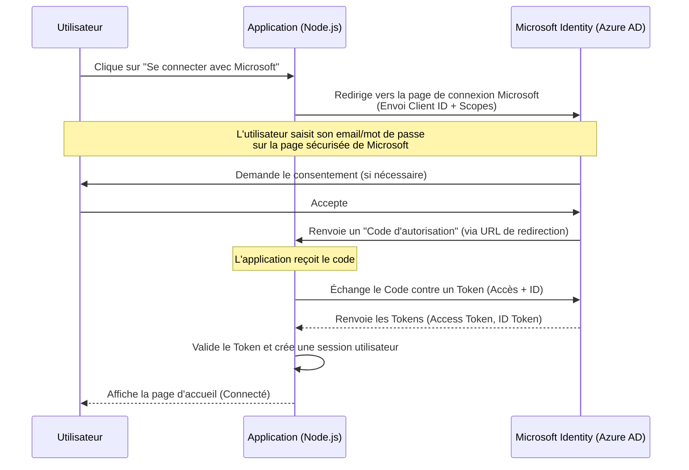

# Comprendre l'Authentification MSAL

**MSAL (Microsoft Authentication Library)** est une bibliothèque qui permet aux applications d'authentifier des utilisateurs via **Microsoft Entra ID** (anciennement Azure Active Directory). Elle gère la complexité des protocoles de sécurité modernes comme **OAuth 2.0** et **OpenID Connect**.

## Pourquoi utiliser MSAL ?

Au lieu de gérer vous-même les mots de passe et la sécurité (ce qui est risqué), vous déléguez cette tâche à Microsoft. L'application reçoit simplement une "preuve" (un jeton) que l'utilisateur est bien qui il prétend être.

## Flux d'Authentification (Schema)

Voici comment cela fonctionne "sous le capot" lorsque vous vous connectez :

## Concepts Clés

1.  **Client ID (Application ID)** : L'identifiant unique de votre application dans Azure.
2.  **Tenant ID (Directory ID)** : L'identifiant de votre organisation (ou "Common" pour tous les comptes Microsoft).
3.  **Client Secret** : Un mot de passe secret que seule votre application connaît pour prouver son identité à Azure.
4.  **Redirect URI** : L'URL où Azure renvoie l'utilisateur après la connexion (par ex: `http://localhost:3003/auth/redirect`).
